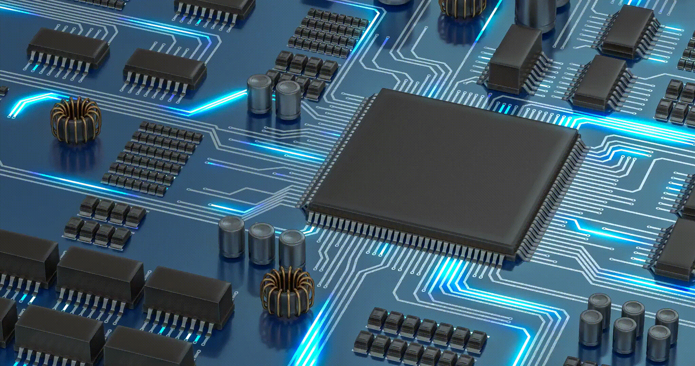
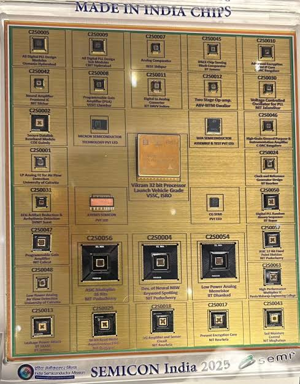

<div align="center">

<!-- ============ HERO / ANIMATED INTRO ============ -->


<br/>


<br/>


<br/>

<!-- ============ PROFILE / VISITOR COUNTERS ============ -->


<br/><br/>

<!-- ============ CONTRIBUTION SNAKE ANIMATION ============ -->


<sub>↑ Live contribution snake — auto-generated via GitHub Actions (workflow included below)</sub>

</div>

<br/>


<div align="center">

### ⚡ 01 / QUICK LINKS

<a href="mailto:subhojit2152mandal@gmail.com">
  
</a>
<a href="https://www.linkedin.com/in/subhajit-mandal-195852412" target="_blank">
  
</a>
<a href="https://github.com/SubhajitMandal25" target="_blank">
  
</a>
<a href="YOUR_PORTFOLIO_URL_HERE" target="_blank">
  
</a>

<sub>⚠️ Replace <code>YOUR_PORTFOLIO_URL_HERE</code> everywhere in this file once your portfolio is deployed.</sub>

</div>

---

### 🧠 02 / ABOUT ME

I'm currently pursuing my B.Tech in Electronics & Communication Engineering at **Guru Nanak Institute of Technology, Kolkata** (2024 – 2028). I'm drawn to the layer where physics meets logic — the point where a bunch of transistors start behaving like decisions.

Most of my time outside coursework goes into VLSI, digital electronics, semiconductor fundamentals, RTL design, and embedded systems. I like understanding how electronic systems actually work underneath, and then trying to turn that understanding into small, real designs — writing a testbench, tracing a signal through a circuit, figuring out why a state machine is misbehaving at 2 AM, that kind of thing.

I'm not claiming expertise here — I'm a student, and I treat these undergrad years as the foundation for a career in semiconductor engineering. Programming, digital design, HDL, and VLSI fundamentals are all things I'm actively improving at, one project at a time.

<table width="100%">
<tr>
<td width="50%" valign="top">

**🎯 Engineering Focus**

- VLSI & Digital Design
- RTL Design (Verilog)
- Semiconductor Fundamentals
- Embedded Systems

</td>
<td width="50%" valign="top">

**🧭 Currently**

- 🎓 B.Tech ECE — 2024 to 2028
- 🔬 Learning RTL verification
- 🛠️ Building small Verilog projects
- 📡 Based in Kolkata, India

</td>
</tr>
</table>

---

### 🎓 03 / EDUCATION

<table width="100%">
<tr>
<td width="70%">

**B.Tech — Electronics & Communication Engineering**
Guru Nanak Institute of Technology, Kolkata
`2024 – 2028`

</td>
<td width="30%" align="right">

🏛️ ECE
📍 Kolkata, India

</td>
</tr>
</table>

<details>
<summary><b>📚 Relevant Coursework</b></summary>
<br/>

| | |
|---|---|
| Digital Electronics | Analog Electronics |
| Electronic Devices | Signals & Systems |
| Communication Systems | Electromagnetic Theory |
| Microprocessors / Microcontrollers | VLSI Fundamentals |
| Programming | Data Structures |

</details>

---

### 🛠️ 04 / TECH STACK

<div align="center">

**💻 Languages**


<br/><br/>

**⚡ VLSI / Hardware**


<br/>


<br/><br/>

**🧰 Tools & Platforms**


<br/>


</div>

> 💡 *Tip: [skillicons.dev](https://skillicons.dev) icons are clickable and load live from their CDN — no assets to maintain. VLSI-specific terms (Verilog, RTL, FSM, UART, FIFO, MOSFET, BJT, CMOS, Icarus Verilog, GTKWave) use styled Shields.io badges since no standard SkillIcon exists for them yet.*

---

### 📊 05 / SKILLS & LEARNING LEVELS

> Labels reflect honest self-assessed comfort — not measured percentages.
> `WORKING` → can build with it · `FAMILIAR` → understand & apply with guidance · `LEARNING` → actively studying

<details open>
<summary><b>⚙️ VLSI / Digital</b></summary>
<br/>

| Skill | Level |
|---|---|
| Digital Logic | 🟢 WORKING |
| Combinational Logic | 🟢 WORKING |
| Sequential Logic | 🟢 WORKING |
| Verilog HDL | 🟡 FAMILIAR |
| RTL Design | 🟡 FAMILIAR |
| FSM | 🟡 FAMILIAR |
| Simulation | 🟡 FAMILIAR |
| Testbench | 🔵 LEARNING |
| FPGA Fundamentals | 🔵 LEARNING |

</details>

<details>
<summary><b>🔌 Electronics</b></summary>
<br/>

| Skill | Level |
|---|---|
| Digital Electronics | 🟢 WORKING |
| Analog Electronics | 🟢 WORKING |
| Electronic Devices | 🟢 WORKING |
| Diodes | 🟢 WORKING |
| BJT | 🟡 FAMILIAR |
| MOSFET | 🟡 FAMILIAR |
| Semiconductor Fundamentals | 🟡 FAMILIAR |

</details>

<details>
<summary><b>💻 Programming</b></summary>
<br/>

| Skill | Level |
|---|---|
| C | 🟢 WORKING |
| C++ | 🟡 FAMILIAR |
| Python | 🟡 FAMILIAR |
| Java | 🔵 LEARNING |

</details>

<details>
<summary><b>🛠️ Tools</b></summary>
<br/>

| Skill | Level |
|---|---|
| GitHub | 🟢 WORKING |
| VS Code | 🟢 WORKING |
| Git | 🟡 FAMILIAR |
| Linux | 🟡 FAMILIAR |
| MATLAB | 🔵 LEARNING |

</details>

---

### 🔬 06 / SELECTED VLSI PROJECTS

<details open>
<summary><b>01 · 4-Bit ALU Design</b> — <code>🟡 IN PROGRESS</code></summary>
<br/>

A 4-bit arithmetic logic unit supporting core arithmetic and logic operations, built from combinational logic blocks.

**Problem:** Design a single functional block capable of performing multiple arithmetic and logic operations on 4-bit operands, selected via a control/opcode input.

**Concepts:** Combinational Logic · Multiplexers · Adders · Opcode-based Operation Selection
**HDL:** Verilog · **Tools:** Icarus Verilog, GTKWave
**Tags:** `Verilog` `RTL` `Digital Logic` `Simulation`
**Repository:** Repository coming soon

</details>

<details>
<summary><b>02 · Traffic Light Controller using FSM</b> — <code>⚪ PLANNED</code></summary>
<br/>

A finite state machine that sequences traffic signal states with defined timing between transitions.

**Problem:** Model a real-world traffic light sequence as a finite state machine with predictable, glitch-free state transitions.

**Concepts:** Finite State Machines · Sequential Logic · State Encoding · Timing Control
**HDL:** Verilog · **Tools:** Icarus Verilog, GTKWave
**Tags:** `FSM` `Verilog` `Sequential Logic` `Testbench`
**Repository:** Repository coming soon

</details>

<details>
<summary><b>03 · UART Transmitter & Receiver</b> — <code>⚪ PLANNED</code></summary>
<br/>

A serial communication module implementing asynchronous transmit and receive paths with baud rate control.

**Problem:** Convert parallel data into a serial bitstream and back reliably across a shared baud rate without a shared clock line.

**Concepts:** Shift Registers · Baud Rate Generation · Framing · Start/Stop Bits · Serial Protocols
**HDL:** Verilog · **Tools:** Icarus Verilog, GTKWave
**Tags:** `Verilog` `RTL` `HDL` `FPGA`
**Repository:** Repository coming soon

</details>

<details>
<summary><b>04 · Synchronous FIFO Memory</b> — <code>⚪ PLANNED</code></summary>
<br/>

A first-in-first-out memory buffer with synchronous read/write control and full/empty flag logic.

**Problem:** Buffer data safely between producer and consumer logic operating on the same clock without overflow or underflow.

**Concepts:** Pointer-based Memory Addressing · Full/Empty Flag Generation · Synchronous Design
**HDL:** Verilog · **Tools:** Icarus Verilog, GTKWave
**Tags:** `RTL` `Digital Logic` `FPGA` `Simulation`
**Repository:** Repository coming soon

</details>

<details>
<summary><b>05 · Digital Clock / Frequency Divider</b> — <code>⚪ PLANNED</code></summary>
<br/>

A counter-based circuit that divides an input clock frequency down to a target output frequency.

**Problem:** Generate a lower, stable output frequency from a fixed high-frequency input clock using digital counters.

**Concepts:** Counters · Clock Division · Sequential Logic · Timing
**HDL:** Verilog · **Tools:** Icarus Verilog, GTKWave
**Tags:** `Verilog` `Digital Logic` `FSM` `HDL`
**Repository:** Repository coming soon

</details>

---

### 🏗️ 07 / VLSI LAB — INSIDE THE CHIP DESIGN FLOW

<table width="100%">
<tr>
<td width="33%" valign="top" align="center">

**🔲 CMOS**
Complementary PMOS and NMOS transistor pairs — the foundation of modern digital chips.

</td>
<td width="33%" valign="top" align="center">

**📝 Verilog**
Hardware description language used to describe digital hardware behavior and structure.

</td>
<td width="33%" valign="top" align="center">

**🧩 RTL Design**
Register-transfer-level representation of digital hardware.

</td>
</tr>
<tr>
<td width="33%" valign="top" align="center">

**🔧 FPGA**
Programmable silicon used for prototyping and testing RTL designs.

</td>
<td width="33%" valign="top" align="center">

**🏗️ ASIC**
Application-specific integrated circuit implementation.

</td>
<td width="33%" valign="top" align="center">

**📐 Physical Design**
Floorplanning, placement, CTS, routing and timing closure.

</td>
</tr>
</table>

---

### 🗺️ 08 / VLSI ROADMAP

<details>
<summary><b>View full 9-stage learning progression</b></summary>
<br/>

```
[1] Digital Logic        → Boolean algebra, gates, combinational & sequential circuits
[2] Computer Organization→ Datapath, control, memory hierarchy
[3] Verilog HDL          → Describing hardware behavior & structure in code
[4] RTL Design           → Designing register-transfer-level modules
[5] Simulation           → Verifying module behavior using waveforms
[6] Verification         → Structured testbenches to catch edge cases
[7] FPGA                 → Mapping RTL designs onto programmable hardware
[8] ASIC Design          → Transitioning toward dedicated silicon
[9] Physical Design      → Floorplanning, CTS, routing, timing closure
```

</details>

<div align="center">

`Digital Logic` → `Comp. Org.` → `Verilog` → `RTL` → `Simulation` → `Verification` → `FPGA` → `ASIC` → `Physical Design`

</div>

---

### 📈 09 / GITHUB ANALYTICS

<div align="center">


<br/>


<br/>


<br/><br/>


</div>

---

### 🖼️ 10 / VISUALS

<div align="center">



<sub>Made in India Chips — SEMICON India 2025 showcase</sub>

</div>

---

### 📡 11 / CURRENTLY LEARNING

<div align="center">


</div>

---

### 🤝 12 / LET'S CONNECT

<div align="center">

Have an idea, project, or opportunity?
**Let's connect.**

<a href="mailto:subhojit2152mandal@gmail.com">📧 Email</a> &nbsp;·&nbsp;
<a href="https://www.linkedin.com/in/subhajit-mandal-195852412">💼 LinkedIn</a> &nbsp;·&nbsp;
<a href="https://github.com/SubhajitMandal25">💻 GitHub</a> &nbsp;·&nbsp;
<a href="YOUR_PORTFOLIO_URL_HERE">🌐 Portfolio</a>

</div>

<br/>


<div align="center">

**Subhajit Mandal**
B.Tech ECE • VLSI • Digital Design • Kolkata, India

*Built with circuits, code & curiosity.*

</div>


